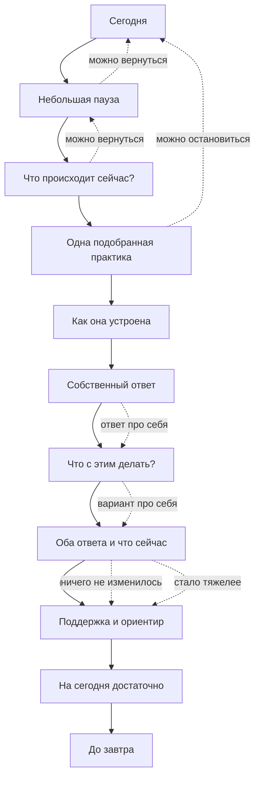

# Редизайн «Опоры»: ежедневный ритуал

Статус: `Canonical` для направления, `Working` для точных текстов и длительности  
Дата: 5 августа 2026 года

## Design Read

Радикальный редизайн мобильного приложения психологической самопомощи для человека в состоянии усталости или тревоги. Вместо каталога функций создаётся единый ежедневный ритуал примерно на две минуты: тёмный, просторный, тактильный и очень спокойный, с мягкостью Journey, Unpacking и Nintendo, но без игры и декоративной «медитативности».

Режим редизайна: `Overhaul` для сценария и информационной архитектуры, `Preserve` для визуальной ДНК бренда.

- `DESIGN_VARIANCE: 4` - ясная композиция без шаблонной симметрии.
- `MOTION_INTENSITY: 3` - движение только для паузы, обратной связи и смены шага.
- `VISUAL_DENSITY: 2` - много пространства, один смысловой объект на экране.

Сохраняются тёмная тема, природный зелёный акцент, крупная типографика, росток как знак бренда и мягкие фоновые переходы. Убираются дашбордность, россыпь карточек, декоративные награды и одновременный выбор нескольких функций.

## 1. Новый пользовательский сценарий

1. **Сегодня.** Приложение приветствует человека и предлагает начать короткую паузу. На экране нет списка функций.
2. **Пауза.** Около 15 секунд мягкого ритма. Дыхание не обязательно: можно дышать по-своему или заметить предметы вокруг. Продолжение остаётся под контролем пользователя.
3. **Что происходит.** Один вопрос и набор формулировок текущего опыта. Это не диагнозы и не названия упражнений.
4. **Подходящая практика.** Приложение само выбирает один навык по ответу. Пользователь не сравнивает каталог практик.
5. **Как это работает.** До чувствительного вопроса показаны цель, инструкция, пример формы, комментарий психолога и возможный эффект без обещания облегчения.
6. **Собственные слова.** Человек отвечает одной-двумя фразами или явно отмечает, что ответил про себя. Личный текст не сохраняется.
7. **Что с этим делать.** На отдельном экране человек формулирует собственный безопасный следующий шаг, реакцию, паузу или обращение за помощью.
8. **Что сейчас.** Человек видит оба собственных ответа и отмечает текущий результат, включая ясность, понимание действия, отсутствие изменения или ухудшение. Облегчение не требуется.
9. **Поддержка.** Только после двух собственных ответов появляется короткая поддержка и безопасный ориентир для реальной жизни.
10. **Завершение.** «На сегодня достаточно». Нет серии, награды, предложения открыть ещё одну функцию или требования вернуться.

При повторном открытии приложение может напомнить название прошлой практики, потому что её идентификатор уже хранится локально. Оно не цитирует и не восстанавливает личный ответ.

## 2. Новая информационная архитектура

### Остаётся

- **Сегодня** - единственная главная точка входа и весь ежедневный ритуал.
- **Напоминания** - необязательная настройка, выключенная по умолчанию.

### Объединяется

- Благодарность, работа с эмоциями, мысли и опоры перестают быть разделами. Их полезные механики становятся возможными практиками внутри ежедневного пути.
- История и психопрофиль в будущем объединяются в **Изменения**. Этот раздел показывает только понятные выводы с достаточной опорой на данные, а не календарь записей и не графики ради графиков.

### Исчезает из действующего продукта

- Каталог упражнений.
- Отдельный журнал мыслей.
- Аптечка, программа устойчивости и экран достижений.
- Толкование снов: оно не связано с основным обещанием продукта и создаёт риск недоказательных интерпретаций.
- Серии, уровни, XP, листья как счётчик прогресса и другие игровые механики.

### Почему раздел «Изменения» не запускается сейчас

Текущая версия не сохраняет личные ответы и субъективное изменение состояния. По одному факту завершения нельзя честно утверждать, что человеку «стало легче» или что он «быстрее восстанавливается». До отдельного решения о локальном хранении и согласии пользователя продукт показывает только безопасную преемственность: дату и название прошлой практики.

## 3. Wireflow

## 4. UX-обоснование

### Главная как сегодняшний день

Один вход снижает паралич выбора и сразу объясняет роль продукта. Человек начинает не с классификации функций, а с короткого контакта с собой.

### Пауза до вопроса

Небольшое замедление отделяет открытие приложения от автоматической реакции. Управляемое продолжение и альтернатива дыханию сохраняют автономию и психологическую безопасность.

### Выбор состояния вместо выбора функции

Формулировки описывают узнаваемый опыт обычным языком. Приложение берёт на себя подбор техники, поэтому пользователь принимает только одно содержательное решение.

### Одна практика

Один навык уменьшает когнитивную нагрузку и делает внутреннее действие заметнее. Практику нельзя «пройти» пустыми нажатиями: нужен текст или явное подтверждение ответа про себя.

### Объяснение до действия

Короткие блоки «почему», «как», «пример», «комментарий» и «что можно заметить» убирают неопределённость. Возможный эффект описывается как наблюдение, а не обещание.

### Собственная мысль до поддержки

Приложение не подставляет аффирмацию и не интерпретирует человека. Сначала человек видит свои слова, затем получает нейтральную поддержку.

### От наблюдения к применению

Фиксация мысли или события не считается завершённой практикой. До проверки результата человек сам формулирует, что безопасно сделать с замеченным. Второй вопрос остаётся внутри того же навыка и не подменяется готовым советом приложения.

### Честное отсутствие эффекта

Варианты «ничего не изменилось» и «стало тяжелее» предотвращают ложноположительное завершение. При ухудшении продукт предлагает остановиться и вернуть приоритет безопасности.

### Завершение без награды

Тихий финал не превращает чувствительную работу в продуктивность. Он возвращает человека в жизнь, а не удерживает внутри приложения.

## 5. План миграции

1. **Сохранить инфраструктуру.** Оставить Next.js, мобильные оболочки, локальные напоминания, safe areas, системную кнопку Android и существующие компоненты форм.
2. **Заменить правило подбора.** Убрать недельное расписание и добавить однозначное соответствие состояния одной из проверенных практик.
3. **Собрать практики.** Для каждого навыка сохранить первый ответ о происходящем и добавить отдельный связанный вопрос о применении, затем рефлексию результата.
4. **Пересобрать главную.** Заменить карточку «практика дня» на последовательность «пауза → состояние → одна практика».
5. **Сохранить приватность.** Не сохранять личный текст и субъективный результат. Продолжить локально хранить только дату и идентификатор завершённой практики.
6. **Оставить старые URL безопасными.** Исторические маршруты продолжают вести на «Сегодня», поэтому закладки и мобильные ссылки не ломаются.
7. **Проверить качество.** Пройти сценарии с текстовым и мысленным ответом, системную кнопку «Назад», повторное открытие в тот же день, светлую и тёмную темы, reduced motion и сборку мобильного экспорта.
8. **Исследовать до расширения.** Проверить понимание подбора, длительность 90-150 секунд и долю пользователей, которые называют собственное наблюдение и следующий шаг. Только после этого решать, нужен ли раздел «Изменения» и какие данные он вправе хранить.

## Критерий успеха

После ритуала человек может назвать не только действие в интерфейсе, но и своё небольшое наблюдение и собственный следующий вариант: мысль стала точнее, понятнее, что делать, появилось немного пространства или честно ничего не изменилось.
